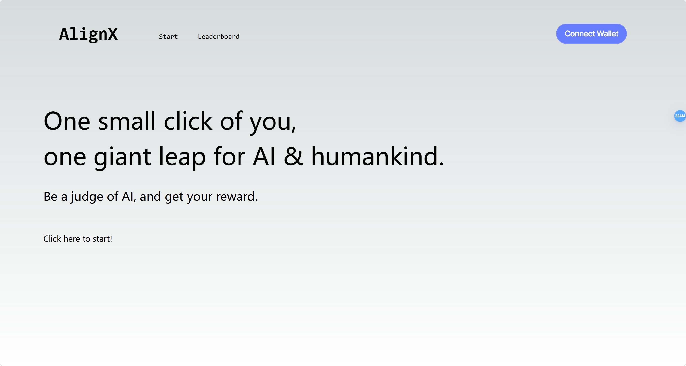
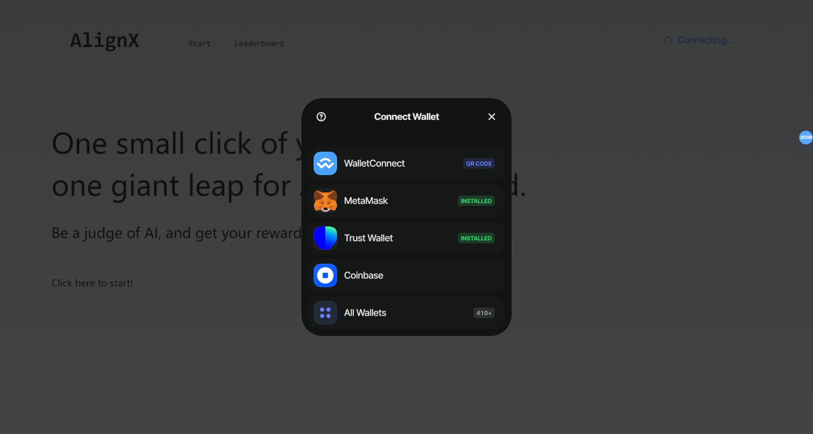
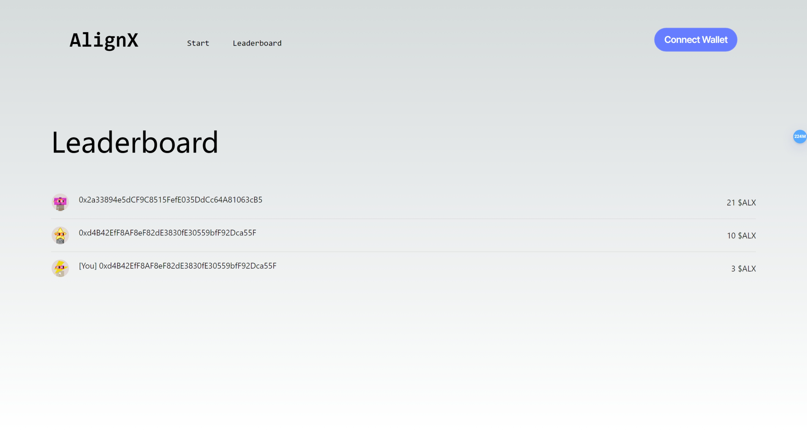
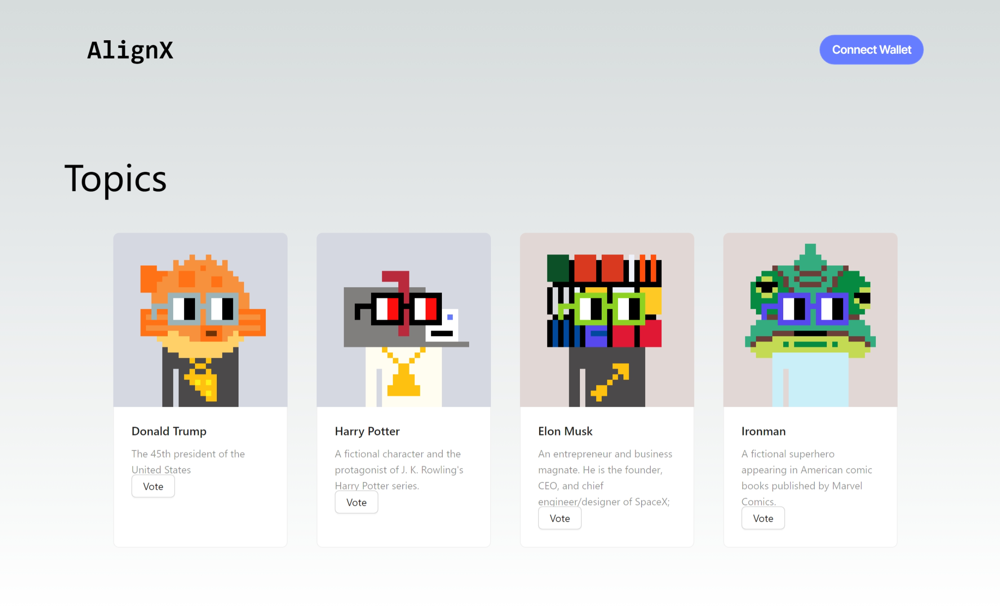
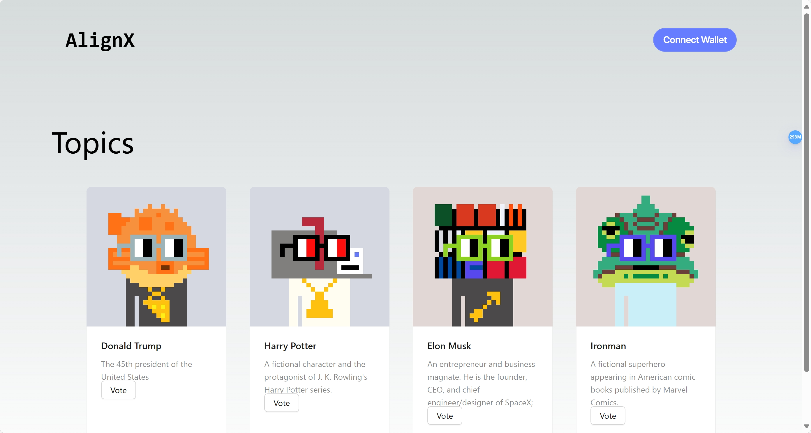

## AlignX
AlignX is the 1st incentive comepatible data crowdfunding platform.

The demo website: https://align-x-ui-phi.vercel.app/

The demo video: https://youtu.be/InextBx7Xo4

## Codes
The codes of the frontend is in the current repo.

The contracts are available [here](https://github.com/AlignX-Lab/AlignX-contract).

The codes of the scenario engine are available [here](https://github.com/AlignX-Lab/AlignX-valuia).











## AlignX Protocol

The figure shows the rules and steps for on-chain and off-chain interaction between parties in the AlignX protocol combined with smart contracts in Web3:
0. First the smart contract initializes the scene and case id
1. The scenario engine generates scenarios according to the requirements of the smart contract
2. AI gives different examples for different scenarios
3. Participants give feedback on different examples in different scenarios
4. Upload and record participants’ feedback in the smart contract
5. Use feedback from all participants to train/update the reward model for training
6. Use the updated reward model to train/update AI
7. Use the updated reward model and AI to provide feedback on the case again and upload the results to the smart contract
8. The smart contract calculates and distributes participants’ income
9. Participants verify their own income based on on-chain data

## Philosophy of AlignX
The goal of AlignX is to allow any group of people who understand a certain issue to "work together" to help AI understand this issue.

To do this, we need each person in the group to faithfully give their own feedback on the topic, because when the AI is smart enough, that's all we need to do - for the AI to understand us efficiently and accurately.

Therefore, AlignX is not designed to learn opinions that everyone agrees with, or a simple majority rule in society, but is designed to help AI learn complex, diverse, and dynamic opinions in society. Unlike traditional data annotation, these opinions are not something that a few "verifiers" can judge right or wrong! It is worth mentioning that such a view is still consistent and not random noise.

As a goal, AlignX hopes to help AI become more and more "aligned" with the participant group in the process of iterations. We also assume that this is the consensus of the majority of participants in each issue, because such a consensus is exactly the basis of an issue. The source of value of AI! Once this consensus no longer exists, this AI no longer has value and meaning.
Intuitively, AlignX's protocol is designed based on this consensus. Our incentive mechanism determines the participants' contributions and incentives through "AI progress in each iteration", because all feedback from all participants collectively determines The direction of AI iteration, so it is not a good strategy for participants to blindly follow the mainstream view or give feedback randomly in each individual feedback. The best strategy is to judge the direction of AI iteration, that is, according to "an alignment with this issue" "AI" stance to provide feedback, which will effectively align the AI with the target issue!

## Readme
This is a [Next.js](https://nextjs.org/) project bootstrapped with [`create-next-app`](https://github.com/vercel/next.js/tree/canary/packages/create-next-app).

## Getting Started

First, run the development server:

```bash
npm run dev
# or
yarn dev
# or
pnpm dev
# or
bun dev
```

Open [http://localhost:3000](http://localhost:3000) with your browser to see the result.

You can start editing the page by modifying `app/page.tsx`. The page auto-updates as you edit the file.

This project uses [`next/font`](https://nextjs.org/docs/basic-features/font-optimization) to automatically optimize and load Inter, a custom Google Font.

## Learn More

To learn more about Next.js, take a look at the following resources:

- [Next.js Documentation](https://nextjs.org/docs) - learn about Next.js features and API.
- [Learn Next.js](https://nextjs.org/learn) - an interactive Next.js tutorial.

You can check out [the Next.js GitHub repository](https://github.com/vercel/next.js/) - your feedback and contributions are welcome!

## Deploy on Vercel

The easiest way to deploy your Next.js app is to use the [Vercel Platform](https://vercel.com/new?utm_medium=default-template&filter=next.js&utm_source=create-next-app&utm_campaign=create-next-app-readme) from the creators of Next.js.

Check out our [Next.js deployment documentation](https://nextjs.org/docs/deployment) for more details.


